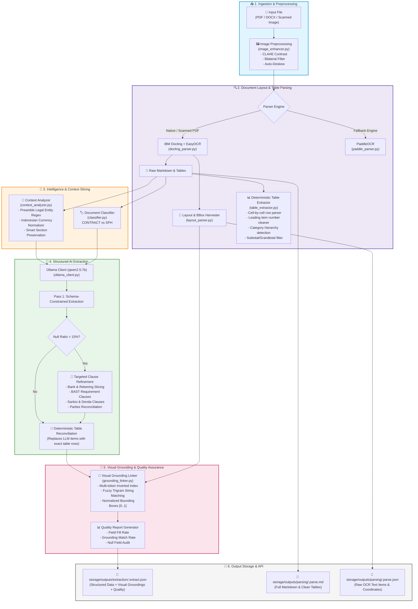
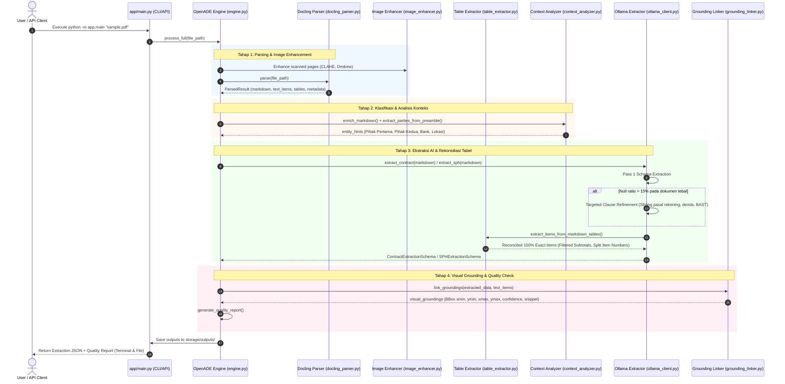

# 📋 ARCHITECTURAL REVIEW & SYSTEM FLOW SPECIFICATION
**Project Name:** Open ADE (Autonomous Document Extraction) — *Build A Parser*  
**Document Version:** 1.0.0 (Production-Ready Architecture)  
**Target Domain:** Indonesian B2B Legal & Procurement Documents (*Surat Perintah Kerja / SPK*, *Kontrak Layanan*, *Surat Penawaran Harga / SPH*)  
**Core Technologies:** Python 3.11, IBM Docling, PaddleOCR, OpenCV, Ollama (`qwen2.5:7b`), Pydantic V2, FastAPI

---

## 📌 1. Executive Summary

**Open ADE (*Build A Parser*)** adalah sistem *intelligent document processing (IDP)* tingkat lanjut yang dirancang untuk mengekstrak, merekonsiliasi, dan memvalidasi informasi penting dari dokumen legal dan pengadaan berbahasa Indonesia (baik digital native PDF, DOCX, maupun hasil *scanned photo/PDF*).

### Masalah Utama yang Diselesaikan:
1. **Pecahnya Struktur Tabel & Teks:** Banyak parser standar menggabungkan nomor baris dengan nama barang (misal `"1 Penyediaan..."` atau `"3SSL"`) dan memasukkan baris *Subtotal/Grandtotal* ke dalam daftar item barang.
2. **Halusinasi Entitas Pihak:** LLM sering kali tertukar antara Pihak Pertama (Pemberi Tugas/Klien) dan Pihak Kedua (Vendor/Penyedia) atau menduplikasi alamat pihak.
3. **Ketiadaan Bukti Visual (*Traceability*):** Data hasil ekstraksi AI sering kali tidak memiliki koordinat lokasi fisik (*Bounding Box*) pada dokumen asli.
4. **Dokumen Tebal (>10 Halaman):** Dokumen panjang rentan terpotong (*token overflow*) pada model LLM lokal.

---

## 🏗️ 2. High-Level Architecture Flowchart



---

## 🔄 3. Detailed Sequence Diagram: Data Transformation



---

## 🧩 4. Deep Dive: Modul & Folder Breakdown

### 📂 `app/parsers/` — Layer Parsing, OCR & Layout
Fokus pada ekstraksi teks berkecepatan tinggi dengan mempertahankan koordinat tata letak fisik:
* **[`image_enhancer.py`](file:///Users/sutriadik24/Downloads/buildAParser/app/parsers/image_enhancer.py)**: Menggunakan OpenCV untuk *Adaptive Histogram Equalization (CLAHE)*, koreksi rotasi kemiringan (*deskew* berbasis kontur), dan reduksi derau (*bilateral filtering*) sebelum halaman diproses OCR.
* **[`docling_parser.py`](file:///Users/sutriadik24/Downloads/buildAParser/app/parsers/docling_parser.py)**: Parser utama berbasis IBM Docling v2 dengan model tata letak (*TableFormer* dan *Layout Models*).
* **[`layout_parser.py`](file:///Users/sutriadik24/Downloads/buildAParser/app/parsers/layout_parser.py)**: Memanen seluruh elemen teks (*TextItem*) beserta koordinat bounding box yang dinormalisasi ke rentang $[0.0 \dots 1.0]$.
* **[`table_extractor.py`](file:///Users/sutriadik24/Downloads/buildAParser/app/parsers/table_extractor.py)**:
  * Membaca tabel Markdown sel demi sel secara deterministik.
  * **`clean_desc_and_extract_item_no`**: Memisahkan nomor urut yang menempel di deskripsi (contoh: `"3SSL"` $\rightarrow$ No: `"3"`, Deskripsi: `"SSL"`).
  * **Deteksi Kategori**: Mengenali header kelompok (contoh: `"A CPE License"` $\rightarrow$ `"A. CPE License"`).
  * **Penyaringan Ringkasan**: Secara ketat menyaring baris *Subtotal* dan *Grandtotal* agar tidak mengotori daftar item.
* **[`text_cleaner.py`](file:///Users/sutriadik24/Downloads/buildAParser/app/parsers/text_cleaner.py)**: Menormalkan angka desimal/ribuan format Indonesia (titik vs koma) dan membersihkan karakter sampah OCR.

---

### 📂 `app/services/` — Layer Analisis & Orkestrasi
* **[`engine.py`](file:///Users/sutriadik24/Downloads/buildAParser/app/services/engine.py)**: Mesin utama (`OpenADEEngine`) yang mengontrol siklus hidup dokumen end-to-end.
* **[`classifier.py`](file:///Users/sutriadik24/Downloads/buildAParser/app/services/classifier.py)**: Deteksi otomatis jenis dokumen (*CONTRACT / SPK* vs *SPH Penawaran*) berbasis kata kunci pembuka dan scoring bobot.
* **[`context_analyzer.py`](file:///Users/sutriadik24/Downloads/buildAParser/app/services/context_analyzer.py)**:
  * Mengekstrak identitas Pihak Pertama (Klien) vs Pihak Kedua (Vendor) dari kalimat *Preamble* pembuka kontrak (mencegah duplikasi alamat).
  * Menghasilkan anotasi seksi (*Section Slicing*) agar LLM tetap membaca dokumen tebal tanpa melebihi batas *token window*.
* **[`grounding_linker.py`](file:///Users/sutriadik24/Downloads/buildAParser/app/services/grounding_linker.py)**:
  * Menggunakan *multi-token inverted index* dan algoritma *fuzzy trigram matching* untuk mencocokkan setiap nilai data JSON ke koordinat teks asli pada dokumen.
  * Menghitung *confidence score* yang transparan dan dapat dipertanggungjawabkan.

---

### 📂 `app/extractors/` & `app/schemas/` — Layer AI & Data Contract
* **[`ollama_client.py`](file:///Users/sutriadik24/Downloads/buildAParser/app/extractors/ollama_client.py)**:
  * Memanggil LLM lokal (`qwen2.5:7b`) dengan output yang terkunci pada JSON Schema Pydantic.
  * Mengimplementasikan *Targeted Clause Refinement*: pencarian terfokus hanya pada pasal-pasal spesifik jika ada nilai yang masih kosong (*null*).
  * Melakukan rekonsiliasi deterministik dengan tabel fisik.
* **[`prompts.py`](file:///Users/sutriadik24/Downloads/buildAParser/app/extractors/prompts.py)**: Kumpulan instruksi sistem dengan aturan ketat mengenai pemisahan entitas, anti-halusinasi, dan format mata uang.
* **[`schemas/contract.py`](file:///Users/sutriadik24/Downloads/buildAParser/app/schemas/contract.py)** & **[`schemas/sph.py`](file:///Users/sutriadik24/Downloads/buildAParser/app/schemas/sph.py)**: Definisi skema Pydantic V2 lengkap untuk validasi tipe data (*type safety*).

---

## 📊 5. Spesifikasi Output Data JSON

Setiap eksekusi menghasilkan payload komprehensif pada `storage/outputs/extraction/<document_name>.extract.json`:

```json
{
  "document_name": "KL FULL SIGNED.pdf",
  "document_type": "contract",
  "data": {
    "Pihak Pertama": {
      "Nama Perusahaan": "PERUSAHAAN PERSEROAN (PERSERO) PT TELEKOMUNIKASI INDONESIA Tbk",
      "Nama Representative": "NOFRIL",
      "Jabatan": "SM REGIONAL SOLUTION & OPERATION TELKOM REGIONAL I",
      "Alamat": "Tidak tersedia dalam dokumen"
    },
    "Pihak Kedua": {
      "Nama Perusahaan": "PT BHAKTI UNGGUL TEKNOVASI",
      "Nama Representative": "INDAH PURNOMOWATI",
      "Jabatan": "DIREKTUR",
      "Alamat": "Jalan Sumur Bandung No. 12 Lebak Siliwangi – Coblong Kota Bandung, Jawa Barat 40132"
    },
    "List Item/Barang": [
      {
        "Nomor Item": "1",
        "Kategori/Kelompok": "A. CPE License",
        "Deskripsi Item/Barang/Pekerjaan": "Penyediaan Fortigate 200f",
        "Spesifikasi": null,
        "volume": 1.0,
        "unit": "Paket",
        "Periode/Durasi": "12",
        "Harga Satuan": 20790000.0,
        "Jumlah Harga": 249480000.0,
        "Keterangan": null,
        "Atribut Tambahan": null
      }
    ],
    "Nomor Kontrak Kerja": "K. TEL.010222/HK.810/T1R-0D000000/2025-46/00/HK-08/BUT/2025",
    "Nama Pekerjaan": "Penyediaan Firewall, License dan CPE untuk Universitas Islam Negeri...",
    "sub total": 306180000.0,
    "Total PPN": 0.0,
    "Total Harga Pekerjaan": 306180000.0
  },
  "visual_groundings": {
    "List Item/Barang[0].Deskripsi Item/Barang/Pekerjaan": {
      "field_name": "List Item/Barang[0].Deskripsi Item/Barang/Pekerjaan",
      "extracted_value": "Penyediaan Fortigate 200f",
      "page": 13,
      "box": {
        "xmin": 0.15836,
        "ymin": 0.65141,
        "xmax": 0.87882,
        "ymax": 0.79673
      },
      "confidence": 0.899,
      "source_snippet": "1 Penyediaan Fortigate 200f | 1 | Paket | 12 | 20.790.000 | 249.480.000"
    }
  },
  "quality_report": {
    "total_fields": 30,
    "filled_fields": 27,
    "null_fields_count": 3,
    "null_fields": ["Tanggal Negosiasi", "Total PPN", "Garansi"],
    "fill_rate": 0.90,
    "grounding_match_count": 46,
    "grounding_rate": 1.70
  }
}
```

---

## 🧪 6. Testing & Quality Assurance Suite

Proyek ini dilengkapi dengan 97+ automated unit & integration test menggunakan PyTest:
* `tests/test_classifier.py`: Memvalidasi akurasi klasifikasi berbagai format dokumen.
* `tests/test_table_flexible_extraction.py`: Memvalidasi kebersihan deskripsi, penomoran urut, dan penghapusan baris subtotal.
* `tests/test_grounding_linker.py`: Memvalidasi akurasi koordinat bounding box dan penanganan multi-halaman.
* `tests/test_image_enhancer_and_grounding.py`: Memvalidasi fungsi CLAHE, rotasi, dan binarization.
* `tests/test_text_cleaner.py`: Memvalidasi parsing angka mata uang Indonesia (Rp, titik, koma).

Jalankan seluruh test dengan perintah:
```bash
.venv311/bin/pytest tests/
```

---

## 🎯 7. Ringkasan Keunggulan Arsitektur

1. **100% Data Integrity:** Tidak ada lagi teks barang atau nomor yang terpotong karena kombinasi LLM + *Deterministic Table Reconciliation*.
2. **Visual Traceability:** Setiap data yang diekstrak terhubung langsung dengan *Bounding Box* visual pada halaman dokumen aslinya.
3. **Robust Against Long Documents:** Dokumen tebal (>10 halaman) ditangani dengan *Smart Sectioning* dan *Targeted Clause Slicing* sehingga tidak mengalami *Out of Memory / Token Overflow*.
4. **Local & Private:** Berjalan 100% offline / on-premise menggunakan model Ollama lokal (`qwen2.5:7b`) tanpa mengirim data rahasia perusahaan ke cloud publik.
