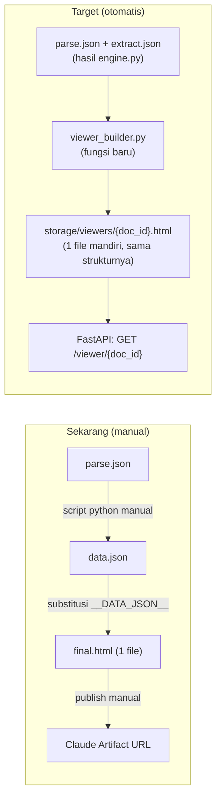
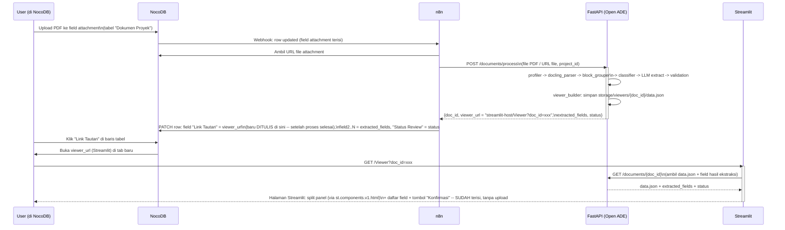

# 📐 DESIGN — Interactive Document Panel (dari Prototipe Claude Artifact ke Fitur Nyata)

**Status:** Draft untuk diskusi
**Terkait:** `ARCHITECTURE_REVIEW.md` (arsitektur pipeline ekstraksi), `app/parsers/block_grouper.py` (layout awareness yang jadi sumber data panel ini)
**Cakupan:** (1) bagaimana mekanik prototipe Claude Artifact (split-panel PDF ⟷ hasil parsing/ekstraksi) dievolusikan jadi komponen nyata, (2) bagaimana ia menyatu dengan FastAPI + Streamlit, (3) jawaban untuk pertanyaan arsitektur NocoDB + n8n: link unik per dokumen yang dibuat SETELAH parse & extract selesai, masuk ke cell NocoDB, dan saat diklik langsung membuka Streamlit dengan panel dokumen + hasil parsing/ekstraksi siap konfirmasi -- tanpa upload manual.

> **Revisi §3 & §4 (dari draft sebelumnya):** draft awal dokumen ini mengusulkan viewer disajikan langsung oleh FastAPI (bukan Streamlit) supaya terasa instan. Setelah didiskusikan lagi: user tetap ingin **Streamlit** yang jadi tempat preview & konfirmasi -- bukan dilewati. Yang berubah dari rencana AWAL bukan "siapa yang menyajikan", tapi KAPAN link itu dibuat: link Streamlit hanya digenerate & ditulis ke NocoDB **setelah** proses parse & extract selesai, dan halaman Streamlit yang dituju **memuat hasil yang sudah ada** by `doc_id` dari URL -- tidak pernah menampilkan form upload. Lihat §3 & §4 versi terbaru di bawah.

---

## 1. Apa yang sudah terbukti bekerja di prototipe

Prototipe Claude Artifact (`https://claude.ai/artifact/B6c1aJ2AjQfsPJJnkUiqZT`) adalah **satu file HTML mandiri**: vanilla JS + CSS, tanpa server, tanpa dependency eksternal. Isinya tiga bagian:

1. **Gambar halaman PDF** (JPEG, di-encode base64) — panel kiri, dengan overlay bounding box yang di-highlight sesuai blok yang dipilih.
2. **`data.json`** (di-embed lewat `<script id="app-data" type="application/json">`) — array per halaman, tiap halaman punya `blocks: [{type, text, box, atomic}]`. `box` adalah bbox ternormalisasi 0..1 (origin kiri-atas, sama seperti `BoundingBox` di `app/schemas/common.py`), `atomic` adalah sub-bbox seperti `atomic_grounding` — struktur ini **sengaja dibuat 1:1** dengan `StructureItem` yang sudah dihasilkan `DoclingParser.parse()`.
3. **JS split-panel**: klik blok teks di panel kanan → scroll & highlight bbox di panel kiri, dan sebaliknya.

Poin penting: prototipe ini **bukan mockup terpisah** — `data.json`-nya barusan di-generate langsung dari `storage/outputs/parsing/SPK_ATS_ORACLE_FULL_SIGNED.parse.json` yang sungguhan (lihat riwayat commit `pair_labels_with_values` fix). Artinya jarak dari "prototipe" ke "fitur nyata" secara teknis sudah dekat — yang belum ada cuma pipa otomatis dari hasil parsing ke file viewer, dan tempat file itu di-hosting.

## 2. Rencana evolusi: dari file statis ke viewer yang di-generate FastAPI

Langkah konkret:

- **`app/services/viewer_builder.py` (baru)** — fungsi murni `build_panel_payload(parse_result, extract_result) -> dict`. Isinya persis logika yang barusan saya lakukan manual: pasangkan `StructureItem` per halaman jadi bentuk `blocks` + field hasil ekstraksi dengan status `AUTO_VERIFIED`/`REVIEW_REQUIRED`. Hasilnya disimpan sebagai `storage/viewers/{doc_id}/data.json` (dan gambar halaman di folder yang sama) — **bukan** langsung di-render jadi HTML, karena yang akan me-render-nya sekarang Streamlit (§3), bukan FastAPI langsung.
- **Template HTML/JS dari prototipe tidak dibuang** — dipindah jadi `app/templates/document_panel.html`, dan dipakai APA ADANYA oleh Streamlit lewat `st.components.v1.html()` (§3): FastAPI cukup menyediakan `data.json`-nya, Streamlit yang membungkusnya jadi 1 halaman utuh (panel split + daftar field + tombol konfirmasi).
- **Endpoint FastAPI**: `GET /documents/{doc_id}` mengembalikan `data.json` + metadata (`status`, field-field hasil ekstraksi) sebagai JSON biasa — dipanggil oleh Streamlit saat halaman viewer dibuka, bukan oleh browser user langsung.

## 3. Peran FastAPI vs Streamlit

Streamlit **tetap jadi tempat user melihat & konfirmasi dokumen** (sesuai rencana awal Fast API + Streamlit) — bagian yang berubah bukan siapa yang menyajikan UI, tapi **kapan** link ke Streamlit itu boleh muncul dan **apa yang sudah dimuat** saat halaman itu dibuka:

| Kebutuhan | Ditangani oleh | Catatan |
|---|---|---|
| Proses PDF: parse + extract + validasi | **FastAPI** (`app/services/engine.py`, tidak berubah) | Berjalan duluan, di belakang, dipicu n8n — user tidak menunggu di depan Streamlit selagi ini jalan |
| Simpan hasil siap-tampil per dokumen | **FastAPI** — `viewer_builder.py` (§2), disimpan by `doc_id` | `doc_id` dibuat SETELAH proses selesai, bukan saat upload — makanya linknya baru valid setelah ini |
| Split panel PDF ⟷ hasil + daftar field + tombol konfirmasi | **Streamlit**, 1 halaman khusus (mis. `pages/Viewer.py`) yang dibuka lewat `?doc_id=...` di URL | Halaman ini **tidak punya form upload sama sekali** — begitu dibuka, langsung `doc_id = st.query_params["doc_id"]`, lalu ambil hasil yang SUDAH ADA dari FastAPI/storage dan tampilkan. User tidak pernah diminta upload apa pun di sini. |
| Antrian PM lintas-dokumen (mana yang `REVIEW_REQUIRED`, dst.) | **Streamlit** (halaman dashboard terpisah, mis. `pages/Dashboard.py`) | Halaman lain, bukan `Viewer.py` — tabel + filter, bisa link ke `Viewer.py?doc_id=...` per baris |
| Trigger drafting BAST setelah field terkonfirmasi | **FastAPI** endpoint, dipanggil dari tombol "Konfirmasi" di `Viewer.py` | Logika bisnis tetap di FastAPI, Streamlit cuma memicu |

Jadi satu proses (upload → proses → link balik ke NocoDB) tetap **satu jalur otomatis** seperti §4 di bawah — bedanya cuma link yang keluar di NocoDB adalah link **Streamlit** (`.../Viewer?doc_id=xxx`), bukan link FastAPI mentah, karena memang Streamlit yang harus tampil ke user.

## 4. Jawaban untuk pertanyaan NocoDB + n8n: link Streamlit dibuat setelah proses selesai, bukan upload manual

**Bisa, dan ini persis skema yang diminta:** link ke Streamlit hanya dibuat SETELAH parse & extract selesai, ditulis ke satu cell NocoDB, dan saat diklik langsung terbuka ke halaman Streamlit yang sudah memuat panel dokumen + hasil parsing/extract — bukan ke halaman upload.

Poin kunci yang membuat ini jalan:

1. **Link ditulis ke NocoDB SETELAH proses selesai, bukan saat upload** — n8n baru mem-PATCH field "Link Tautan" setelah `POST /documents/process` di FastAPI mengembalikan hasil (§ di atas). Selama proses masih berjalan, cell itu boleh kosong atau berisi status "Sedang diproses" — jadi user tidak pernah mengklik link yang mengarah ke halaman kosong/belum siap.
2. **`doc_id` unik per dokumen** (per konteks proyek + file, bukan per baris NocoDB) — FastAPI yang membuatnya begitu proses selesai, dan `viewer_url` yang dikembalikan sudah lengkap berisi `doc_id` itu (`.../Viewer?doc_id=xxx`), jadi n8n tidak perlu merakit URL sendiri, cukup tulis apa adanya ke NocoDB.
3. **Halaman Streamlit `Viewer.py` tidak punya form upload** — satu-satunya isi awalnya adalah baca `doc_id` dari `st.query_params`, lalu `GET /documents/{doc_id}` ke FastAPI untuk ambil hasil yang SUDAH ADA. Kalau `doc_id` tidak ditemukan (link rusak/expired), tampilkan pesan error, bukan form upload — supaya tidak ada jalan user "kebetulan" diminta upload manual.
4. **NocoDB webhook native** ("On row update", difilter ke field attachment) + **REST API update field** sudah cukup untuk n8n — tidak ada komponen baru di luar yang sudah direncanakan.
5. **Field "Link Tautan" cukup 1 kolom URL di NocoDB** (tipe field: URL) — otomatis dirender sebagai link yang bisa diklik.

### Yang perlu diputuskan (bukan blocker, tapi perlu disepakati sebelum implementasi)

- **Auth di `Viewer.py` / `GET /documents/{doc_id}`** — dokumen kontrak berisi info sensitif (nominal, pihak). Kalau Streamlit & FastAPI sudah di jaringan internal/VPN yang sama dengan NocoDB, ini bisa mengandalkan jaringan itu saja. Kalau tidak, `doc_id` sebaiknya UUID acak (bukan angka urut) sebagai *security by obscurity* minimal, atau tambahkan token pendek di query string yang divalidasi Streamlit/FastAPI sebelum memuat data.
- **Status transisi "sedang diproses"** — karena link baru terisi setelah proses selesai (bisa puluhan detik untuk dokumen OCR-berat), field "Status Review" di NocoDB sebaiknya diisi n8n DUA kali: sekali segera setelah webhook masuk ("Sedang diproses", link masih kosong), sekali lagi setelah FastAPI selesai ("Siap Review", link terisi) — supaya user tidak bingung melihat baris tanpa link untuk sementara.
- **Sinkron ulang kalau dokumen di-upload ulang/direvisi** — `doc_id` sebaiknya = hash konten file (bukan nomor baris NocoDB), supaya upload PDF yang identik tidak memproses ulang, tapi PDF baru walau di baris NocoDB yang sama akan mendapat `doc_id` & link baru.
- **Ukuran gambar halaman** untuk dokumen banyak halaman (mis. PKS 14 halaman) — jangan di-embed base64 semua sekaligus ke `data.json`; sajikan lewat `GET /documents/{doc_id}/page/{n}.jpg` dan biarkan komponen HTML di Streamlit fetch per halaman saat dibuka.
- **Status `AUTO_VERIFIED` tetap bukan approval otomatis** (aturan yang sudah disepakati sebelumnya) — `Viewer.py` harus tetap menampilkan tombol "Konfirmasi" yang memanggil balik FastAPI, bukan menganggap field hijau = selesai.

## 5. Spesifikasi Split-Panel Interaktif: Continuous Multi-Page Auto-Scroll (Tanpa Pagination Kaku)

Sesuai kebutuhan UX, panel dokumen kiri **tidak menggunakan tombol pagination kaku** (misal harus klik "Next Page" 21 kali). Panel ini berupa **Continuous Virtual Canvas**:

### 5.1 Mekanisme Deep-Linking & Auto-Scroll
1. **Tata Letak Bersambung (Continuous Container):**
   Seluruh halaman PDF (Halaman 1 sampai Halaman N) dirender dalam satu kontainer vertikal scrollable (`#pdf-canvas-container`).
2. **Deep-Linking ke Halaman & Bounding Box:**
   Ketika user mengklik salah satu field di panel kanan (misal: "Klausul Garansi" yang berada di Halaman 21), script JavaScript pada komponen viewer langsung:
   - Mengambil metadata halaman (`page: 21`) dan koordinat bounding box (`box: {xmin, ymin, xmax, ymax}`).
   - Menghitung posisi absolut Y target di dalam kontainer:  
     $$\text{Target } Y = \text{OffsetTop}(\text{Page}_{21}) + (\text{box.ymin} \times \text{PageHeight}) - 100\text{px}$$
   - Melakukan **Smooth Auto-Scroll** seketika menuju lokasi tersebut.
   - Mengaktifkan animasi sorot (*pulse highlight overlay*) pada bounding box bersangkutan.

### 5.2 Optimasi Dokumen Panjang (20+ Halaman)
- **Lazy Loading Halaman:** Gambar halaman diambil secara on-demand via endpoint `GET /documents/{doc_id}/page/{n}.jpg` saat halaman tersebut mendekati viewport layar, sehingga dokumen 50+ halaman tetap terbuka instan (<0.5 detik).
- **Interaksi Dua Arah (Bidirectional):**
  - Klik field di form kanan $\rightarrow$ Auto-scroll & sorot bounding box di halaman target di panel kiri.
  - Klik blok teks/tabel di panel kiri $\rightarrow$ Auto-focus & highlight field input yang bersesuaian di panel kanan.

---

## 6. Efisiensi Ekstraksi: Pydantic-Constrained LLM & Deterministic TableFormer

Menjawab pertimbangan performa terkait konteks penuh dokumen dan struktur tabel:

### 6.1 Apakah Pembacaan Konteks Penuh Memberatkan LLM?
**Tidak memberatkan**, karena pembagian tugas (*separation of concerns*) yang sangat ketat:
1. **LLM Dibatasi Ketat pada Skema Pydantic (`format=Schema.model_json_schema()`):**
   LLM Qwen 2.5 7B hanya bertugas melakukan pemahaman penalaran semantik dan memetakan nilai ke skema Pydantic. Tidak ada *conversational bloat* atau halusinasi format.
2. **Konteks Kaya (*Rich Context*):**
   Input ke LLM adalah Markdown bersih hasil Docling yang telah diperkaya oleh [context_analyzer.py](file:///Users/sutriadik24/Downloads/buildAParser/app/services/context_analyzer.py) dengan penanda `[SECTION: ...]` dan `[KEY: ...]`. Hal ini menjamin LLM memahami konteks seluruh dokumen tanpa tersesat.
3. **Ekstraksi Tabel 100% Presisi Tanpa Membebani LLM:**
   - LLM **tidak dibebani** untuk mengetik ulang ratusan baris tabel sel demi sel (yang rawan token limit & lambat).
   - Ekstraksi struktur sel, baris (*rows*), kolom (*columns*), header, dan merged cells ditangani 100% oleh model deep-learning **IBM Docling TableFormer** dan [table_extractor.py](file:///Users/sutriadik24/Downloads/buildAParser/app/parsers/table_extractor.py).
   - **Hasil:** Tabel terambil persis 1:1 sesuai bentuk aslinya di PDF, struktur sel rapi, memiliki bounding box visual grounding per sel, dan prosesnya berlangsung deterministik dalam waktu **< 0.5 detik**.

---

## 7. Ringkasan Keputusan

- **Continuous Scroll Panel:** Viewer Streamlit (`pages/Viewer.py` via `st.components.v1.html`) menyajikan seluruh halaman dokumen secara bersambung dengan fitur auto-scroll instan ke halaman target (mis. Hal 21) saat field diklik.
- **Pydantic-Constrained LLM:** Qwen 2.5 7B fokus membaca konteks menyeluruh untuk field semantik legal & ringkasan bisnis.
- **Deterministic TableFormer:** Tabel BoQ/rincian biaya diekstrak deterministik dari layout Docling sehingga struktur sel baris-kolom identik dengan PDF asli tanpa membebani LLM.
- **Workflow NocoDB $\rightarrow$ n8n $\rightarrow$ FastAPI $\rightarrow$ Streamlit:** Link viewer unik dibuat otomatis setelah proses backend selesai, langsung membuka preview siap-konfirmasi tanpa form upload manual.

